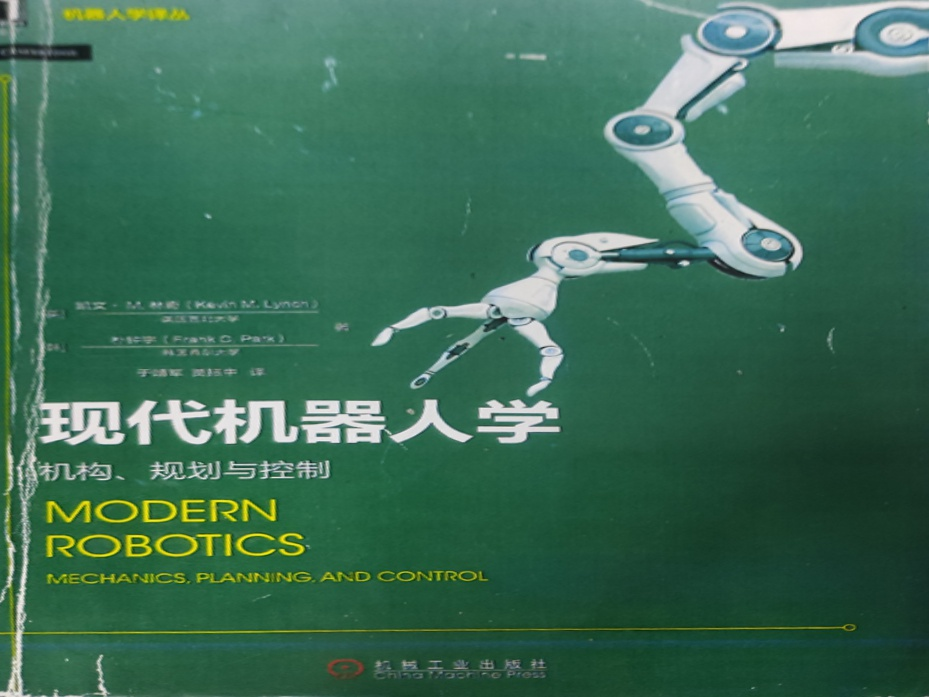

# IMGcorrection
该脚本为利用opencv制作的简单图像校正程序

This script is a simple image correction program made by opencv


# How to use
在运行前先配置好python运行环境，然后在终端运行：python IMGcorrection.py即可

Before running the command, configure the python runtime environment and run the command python SimpleIMGcorrection.py on the terminal

可以通过修改内部if __name__ == "__main__":下的image_path来选择自定义图片路径

The custom image path can be selected by modifying the image_path under the internal if __name__ == "__main__":

- Test with image
```
python IMGcorrection.py
```
Original picture：

Outputs：


# Notes:
- this script is still editting
- The principle of the script is to find all corners through the Harris algorithm and use the norm distance to find four corners, and finally the four corners of the image for perspective transformation, may not be compatible with all lighting environments, is being optimized, any suggestions can be posted.
